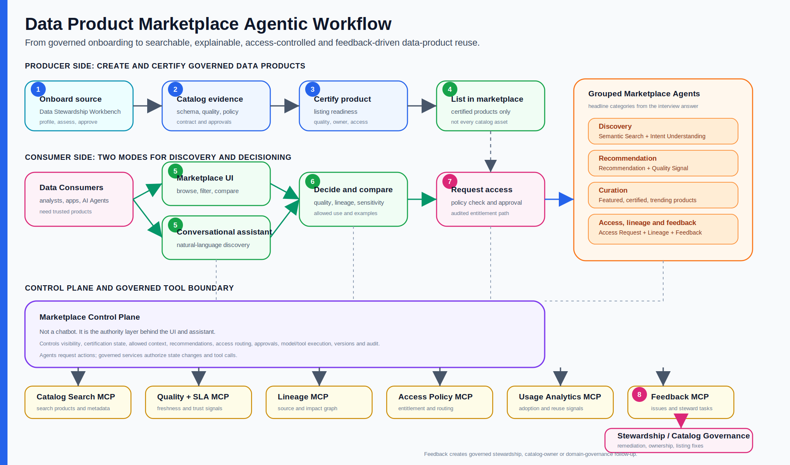

# Data Product Marketplace Agentic Workflow Reference Implementation

## Extending governed data-product onboarding into discovery, recommendation and reuse

The Agentic Data Stewardship Workbench currently focuses on one hard enterprise problem:

> How does an external dataset become a governed, AI-ready data product with evidence, Human approval, quality controls and catalog publication?

The next natural extension is the marketplace problem:

> Once governed data products exist, how do employees, analysts, data scientists, applications and Agents discover the right product, understand whether it is trustworthy, request access, use it responsibly and provide feedback?

This reference implementation describes a platform-agnostic operating model for an Agentic Data Product Marketplace. It connects directly to the Data Stewardship Workbench: the Workbench creates governed products; the marketplace helps consumers find, trust and reuse them.

The reference implementation remains vendor-neutral. The enterprise catalog and marketplace could be implemented using Microsoft Purview, Microsoft Fabric, Databricks Unity Catalog, Collibra, Alation, Informatica or a custom enterprise data-product portal. The important architectural idea is the governed agentic layer above the catalog, not the specific vendor product underneath.

---

## 1. Relationship to the Data Stewardship Workbench

The current Workbench is the upstream governance engine.

```text
External dataset
  -> Data Stewardship onboarding workflow
  -> deterministic profiling and quality evidence
  -> specialist Data Stewardship Agent recommendations
  -> Human Data Steward approval
  -> governed catalog publication through MCP
  -> governed data product
```

The marketplace extension starts after that point.

```text
Governed data product
  -> certification and marketplace listing
  -> semantic discovery
  -> recommendation and curation
  -> access request and approval
  -> lineage, trust signals and responsible use
  -> feedback and re-stewardship
```

The same principle still applies:

> Agents prepare search results, recommendations, explanations and access guidance. The control plane governs policy, approvals, tool execution and audit. Humans remain accountable for material data decisions.

---

## 2. Functional problem

Enterprises increasingly publish data products, but consumers still struggle to answer practical questions:

- Which data product should I use for this business problem?
- Is this product certified or still experimental?
- What does each field mean?
- How fresh, complete and reliable is it?
- Does it contain personal, confidential or regulated data?
- Can I use it for analytics, AI training, reporting or operational decisions?
- Who owns it, who else uses it and what downstream processes depend on it?
- How do I request access?
- What should I do if the data quality is not fit for purpose?

A traditional catalog helps store metadata. A marketplace should help consumers make a governed usage decision.

The agentic opportunity is not just natural-language search. It is guided, governed data-product consumption.

---

## 3. Target operating model

The target operating model separates cataloging, marketplace listing and consumer guidance.

| Layer | Purpose |
|---|---|
| Data Stewardship onboarding | Creates governed, versioned, approved data products |
| Enterprise Data Catalog | Stores metadata, schema, classification, lineage, owners, quality signals and contracts |
| Certification and listing | Decides which cataloged products are marketplace-ready |
| Data Product Marketplace | Presents certified products for discovery, comparison, access and reuse |
| Agentic discovery layer | Helps consumers search, reason, compare, request and provide feedback |
| Control plane | Enforces policy, approvals, tool permissions, evidence, limits and audit |

Catalog and marketplace should not be treated as the same thing.

- The catalog may contain many technical assets and governed products.
- The marketplace should expose products that are approved, understandable and consumable.
- A product can be cataloged but not yet listed.
- Marketplace listing should require certification rules and/or Human approval.

---

## 4. End-to-end flow



> **How to read this visual:** the Data Stewardship Workbench creates governed products, the catalog stores approved evidence, the marketplace exposes certified products, and specialist Agents help consumers discover, compare, request and provide feedback under control-plane governance.

The full lifecycle has eight numbered steps, also shown in the visual:

1. **Onboard:** the Data Stewardship Workbench profiles, assesses, classifies, contracts and publishes a governed product.
2. **Catalog:** product metadata, schema, quality rules, classification, lineage references, contract and approvals are stored in the enterprise catalog.
3. **Certify:** marketplace readiness is evaluated using quality, ownership, classification, documentation, contract and approval criteria.
4. **List:** certified products become discoverable through the marketplace.
5. **Discover:** consumers use marketplace search, filters, recommendations or a conversational assistant.
6. **Decide:** consumers inspect quality, lineage, sensitivity, allowed uses, access terms and usage examples.
7. **Request:** access requests are checked against policy, routed for approval where needed and audited.
8. **Feedback:** usage signals, ratings, issues and quality complaints route back into stewardship, catalog ownership or domain governance.

---

## 5. Specialist marketplace Agents

The reference implementation uses bounded specialist Agents grouped into the same marketplace capability categories shown in the functional flow. This keeps the interview framing simple: Discovery, Recommendation and Curation are the headline categories, with access, lineage and feedback as governed supporting capabilities.

| Category | Specialist Agents | What they do | Cannot do |
|---|---|---|---|
| **Discovery** | Discovery and Semantic Search Agent; Intent Understanding Agent | Interpret the consumer's need, translate natural language into governed catalog queries and ask bounded clarification questions | Grant access, certify products or invent metadata |
| **Recommendation** | Recommendation Agent; Quality Signal Agent | Rank relevant products using intent, role, certification, quality, freshness, sensitivity, usage and fit-for-purpose signals | Override quality facts, hide warnings or bypass access policy |
| **Curation** | Curation Agent | Maintain featured, certified, domain-relevant and trending marketplace collections; identify stale or duplicate products | Publish products without certification or Human/domain-owner approval where required |
| **Access, lineage and feedback** | Access Request Agent; Lineage Explanation Agent; Feedback Agent | Structure access requests, explain upstream/downstream trust evidence, capture feedback and route stewardship or catalog-improvement actions | Approve restricted access, change lineage records, or close material issues without steward, owner or governance review |

Lineage is not treated as a sub-function of Recommendation. Recommendation can use lineage trust as one ranking signal, but the Lineage Explanation Agent has a separate responsibility: explaining source, transformation, dependency and impact evidence without inventing lineage.

These Agents can power both a traditional marketplace UI and a conversational search experience. They reason over governed catalog evidence; they do not become the governance authority.

---

## 6. Two consumer interaction models

The marketplace should support two complementary interaction models.

### Marketplace UI

This is the familiar browse-and-search experience:

- product cards;
- filters by domain, owner, certification, quality, sensitivity and freshness;
- comparison of similar products;
- lineage and quality tabs;
- access request button; and
- feedback and issue reporting.

Agents operate behind the scenes by improving search, ranking, recommendations, explanations and routing.

### Conversational discovery

This supports more complex questions:

```text
Find me a customer data product for EMEA churn analysis.
It should be approved for analytics use, refreshed at least daily,
and should not include direct identifiers unless access can be justified.
```

The assistant should:

1. interpret intent;
2. query catalog and quality metadata;
3. rank candidate products;
4. explain trade-offs;
5. identify access constraints;
6. ask bounded clarification questions if needed; and
7. prepare an access request or stewardship question when the consumer decides.

Both interaction models use the same governed tools and control plane.

### Example discovery journeys

| Domain | Example consumer need | How the marketplace Agents help |
|---|---|---|
| Legal Entity | "I need supplier legal-entity data for third-party risk analytics, refreshed monthly, with LEI and country coverage." | Discovery maps the need to Legal Entity products, Recommendation ranks certified products by completeness and freshness, Quality Signal explains LEI/country issues, Lineage explains source and downstream use, and Access Request prepares the approval package. |
| Customer | "I need customer data for EMEA churn analysis, approved for analytics use, without exposing direct identifiers unless justified." | Intent Understanding clarifies region and use, Discovery searches Customer products, Recommendation prioritizes certified analytics-ready products, Quality Signal highlights completeness and recency, and Access Request applies sensitivity and allowed-use policy. |

---

## 7. Control-plane responsibilities

The marketplace control plane must prevent discovery convenience from becoming governance bypass. Consumers normally interact with the Marketplace UI or Conversational Assistant; those experience surfaces call the control plane. The control plane mediates what the marketplace can show, what an Agent may see, and which governed tools may execute.

It should own:

- consumer identity, role and business context;
- query and tool execution policy;
- product visibility rules;
- certification state and marketplace listing status;
- sensitive-data handling and allowed-use policy;
- bounded clarification and recommendation limits;
- access request workflow and approval routing;
- version-aware product recommendations;
- audit events for search, recommendation, access and feedback;
- model-attempt, cost and latency observability; and
- escalation when confidence is low or policy is ambiguous.

Agents should not directly query everything or execute every action. The control plane should decide what data each Agent may see and which tool calls it may request. In other words, the control plane is not a consumer-facing chatbot; it is the authority layer behind the marketplace and assistant experiences.

---

## 8. MCP and governed tool boundary

The current Data Stewardship prototype already demonstrates a real local MCP boundary with simulated catalog publication tools. The marketplace extension would add marketplace-oriented MCP servers or tool groups.

| MCP/tool group | Example capabilities |
|---|---|
| Catalog Search MCP | Search data products, filter by domain, certification, owner, classification, schema and tags |
| Product Metadata MCP | Read product descriptions, schema, contracts, glossary terms, owners and documentation |
| Quality and SLA MCP | Read quality scores, failed rules, freshness, SLA history and monitoring signals |
| Lineage MCP | Query upstream sources, transformations, downstream consumers and dependency impact |
| Access Policy MCP | Check entitlements, allowed use, sensitivity restrictions and approval route |
| Usage Analytics MCP | Read popularity, reuse, consumer segments and recent adoption signals |
| Feedback MCP | Create feedback records, issue tickets and steward review requests |
| Notification MCP | Notify owners, approvers, stewards and consumers of status changes |

In production, these MCP servers may wrap enterprise APIs rather than owning the underlying systems. The MCP boundary is useful because it makes tool authority explicit, observable and testable.

---

## 9. Search and recommendation design

Search should combine deterministic filtering, semantic retrieval and governed ranking.

### Deterministic filters

Used for facts that should not be guessed:

- certification status;
- domain;
- owner;
- classification;
- allowed usage;
- refresh frequency;
- SLA;
- quality thresholds;
- geography;
- access restrictions; and
- product version.

### Semantic retrieval

Used for meaning and intent:

- match user language to business glossary terms;
- map business problem to likely domains;
- identify synonyms and related concepts;
- find products with similar descriptions, schemas or usage patterns; and
- support conversational clarification.

### Governed ranking

Ranking should consider:

- relevance to user intent;
- certification and steward endorsement;
- quality and freshness;
- sensitivity and access feasibility;
- adoption and consumer feedback;
- lineage trust and source authority;
- contractual fit for intended use; and
- product recency and version status.

The system should explain why a product was recommended. A consumer should be able to see whether a result appeared because it is semantically similar, highly certified, frequently reused, owned by a trusted domain, or simply the only product available.

---

## 10. Certification and marketplace listing

The Data Stewardship Workbench publishes a governed catalog package. A separate listing decision should determine whether that product appears in the marketplace.

Example certification criteria:

- named accountable owner and steward;
- approved current data contract;
- approved classification and allowed use;
- required glossary and schema documentation;
- quality rules registered and passing within threshold;
- SLA and refresh frequency documented;
- lineage reference available or exception approved;
- access policy configured; and
- no unresolved critical issues.

Certification can be:

- **automated** for low-risk products that meet all objective criteria;
- **Human-approved** for sensitive, regulated or high-impact products; or
- **blocked** when required evidence is incomplete.

This mirrors the current Workbench principle: automation can prepare and check evidence, but material governance decisions remain explicit.

---

## 11. Access request and entitlement flow

Marketplace search is not the same as data access.

A consumer may be able to discover a product without being allowed to use the underlying data.

The access flow should be:

```text
Consumer selects product
  -> Access Request Agent asks intended-use questions
  -> Access Policy MCP checks role, purpose, sensitivity and allowed use
  -> control plane determines route
  -> automatic approval, Human approval or rejection
  -> decision and rationale are audited
  -> entitlement system grants access if approved
```

Sensitive products may require additional controls:

- business purpose;
- project or engagement ID;
- geography and residency;
- retention need;
- AI-training or secondary-use restrictions;
- privacy review;
- data owner approval;
- legal/compliance approval; and
- periodic recertification.

---

## 12. Lineage and trust signals

A searchable marketplace should help consumers understand trust, not just locate assets.

Lineage and trust signals should answer:

- Where did this product originate?
- Which upstream systems and transformations produced it?
- Is it derived from certified sources?
- Which reports, models, dashboards or applications already use it?
- What would break if this product changed?
- Which version is current?
- Which quality rules are currently passing or failing?
- Has freshness declined?
- Have consumers reported issues?

The Lineage Explanation Agent should translate graph data into plain language, but it should not invent lineage. If lineage is missing, it should say so and route the gap back to stewardship.

---

## 13. Feedback loop back to stewardship and catalog governance

Marketplace usage should improve stewardship.

Consumer feedback can create new stewardship work:

- product description is unclear;
- field meaning is ambiguous;
- data is not fit for the stated purpose;
- quality defect escaped onboarding;
- access process is too slow;
- duplicate products exist;
- lineage is incomplete;
- refresh frequency does not meet demand; or
- a new use case requires a contract or policy update.

The Feedback Agent should classify feedback, suggest severity and route it to the accountable steward, product owner or catalog governance queue. Feedback goes back to the Data Stewardship Workbench when it requires data remediation, a new dataset version, product-policy review or contract change. Simpler documentation, ownership or marketplace-listing issues may route to catalog ownership or domain governance instead. The control plane should decide whether the feedback creates:

- a documentation task;
- a quality investigation;
- a product-policy review;
- a contract change;
- a new dataset version request;
- deprecation of a duplicate product; or
- escalation to domain governance.

This completes the loop:

```text
Discover -> Use -> Feedback -> Stewardship / Catalog Governance -> Improved Product -> Marketplace
```

---

## 14. Current Reference Implementation versus marketplace extension

| Capability | Current Data Stewardship Reference Implementation | Marketplace extension |
|---|---|---|
| Product onboarding | Implemented locally | Reused as upstream source |
| Deterministic profiling | Implemented for CSV samples | Feeds quality/trust signals |
| Human approval | Implemented for assessment, contract and publication | Extended to certification, access and exceptions |
| MCP catalog publication | Implemented with simulated catalog tools | Extended with search, metadata, lineage, access, usage and feedback tools |
| Marketplace listing | Not implemented | Reference extension |
| Semantic search | Not implemented | Discovery Agent and Catalog Search MCP |
| Recommendation | Not implemented | Recommendation Agent using metadata, quality and usage signals |
| Access workflow | Not implemented | Access Request Agent and Access Policy MCP |
| Lineage explanation | Target-state only | Lineage Agent and Lineage MCP |
| Consumer feedback | Not implemented | Feedback Agent and steward remediation loop |

The current reference implementation does not need to become the marketplace UI. It can remain the governed producer-side Workbench. The marketplace can be a separate consumer-side application that consumes the cataloged outputs from the Workbench.

---

## 15. Enterprise target state

In a production architecture, the marketplace would sit within a broader data-product operating model.

```text
Data producers
  -> Data Stewardship workflows
  -> Enterprise catalog and policy services
  -> Marketplace certification
  -> Consumer discovery and access
  -> Usage, quality and feedback telemetry
  -> Continuous product improvement
```

Target-state capabilities include:

- enterprise identity and role context;
- product-domain ownership and stewardship operating model;
- catalog integration across warehouse, lakehouse, BI, AI and application assets;
- business glossary and semantic layer integration;
- lineage and impact analysis;
- quality and observability platform integration;
- access policy and entitlement integration;
- usage analytics and recommendation features;
- Human approval queues and separation of duties;
- tamper-evident audit and evidence retention;
- evaluation of search, recommendation, access routing and Agent behavior; and
- model/tool gateway governance for all marketplace Agents.

---

## 16. Evaluation approach

Marketplace Agents require a different evaluation strategy from onboarding Agents.

| Evaluation layer | Example checks |
|---|---|
| Search relevance | Known test queries return expected products in the top results |
| Deterministic policy | Restricted products are hidden or marked correctly based on role and allowed use |
| Recommendation quality | Expert-labelled scenarios rank appropriate products above weaker alternatives |
| Explanation faithfulness | Agent explanations cite actual metadata, lineage and quality signals |
| Access routing | Requests are routed to the correct approver or auto-decision path |
| Safety and privacy | Sensitive product details are not exposed to unauthorized consumers |
| Workflow trajectory | Search, clarification, recommendation, access request and feedback events are auditable |
| Production outcomes | Time to find product, reuse rate, access cycle time, steward rework and consumer satisfaction |

The same warning from the Data Stewardship Workbench applies: do not present one generic Agent score as proof of quality. Search relevance, policy behavior, explanation faithfulness and production outcomes are different evaluation problems.

---

## 17. Possible demonstration storyboard

A simple future demonstration could show:

1. a governed Legal Entity product created by the current Data Stewardship Workbench;
2. the product appears in the catalog but is not marketplace-listed until certification checks pass;
3. a consumer searches: "I need supplier legal entity data for risk analytics";
4. the Discovery Agent returns certified candidate products and explains ranking;
5. the Quality Signal Agent highlights completeness, duplicate-rate and freshness signals;
6. the Lineage Agent explains source and downstream usage;
7. the Access Request Agent asks intended-use questions and prepares a request;
8. the control plane routes the request based on classification and policy;
9. the consumer submits feedback about a missing field description; and
10. the Feedback Agent routes a stewardship task back to the accountable owner.

This would demonstrate both sides of the data-product lifecycle:

- producer-side governed onboarding; and
- consumer-side governed discovery and reuse.

---

## 18. Reference implementation takeaway

Making a data marketplace searchable is useful. Making it governed, explainable and feedback-driven is more valuable.

The Data Stewardship Workbench proves how governed data products can be created. The Agentic Data Product Marketplace extends that pattern to how governed products are discovered and reused.

The architectural through-line is consistent:

> Deterministic systems establish facts. Specialist Agents help people reason over those facts. The control plane governs authority, policy, tools, versions and evidence. Humans remain accountable for material data decisions.

---

## Further Reading

- [Enterprise Agentic Workflows index](README.md)
- [Data Stewardship Agentic Workflow Reference Implementation](data-stewardship-agentic-workflow-reference-implementation.md)
- [Media Buying Agentic Workflow Reference Implementation](media-buying-agentic-workflow-reference-implementation.md)
- [Role-Based Agentic Software Delivery Reference Implementation](role-based-agentic-software-delivery-reference-implementation.md)

