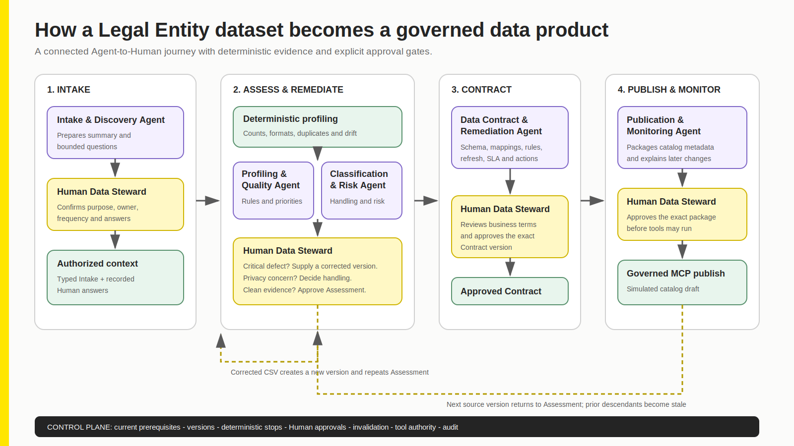
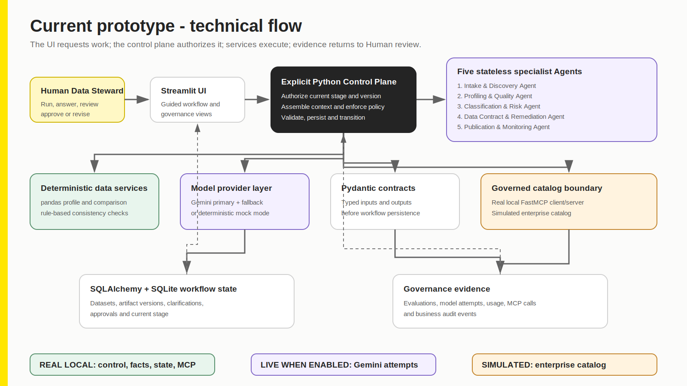
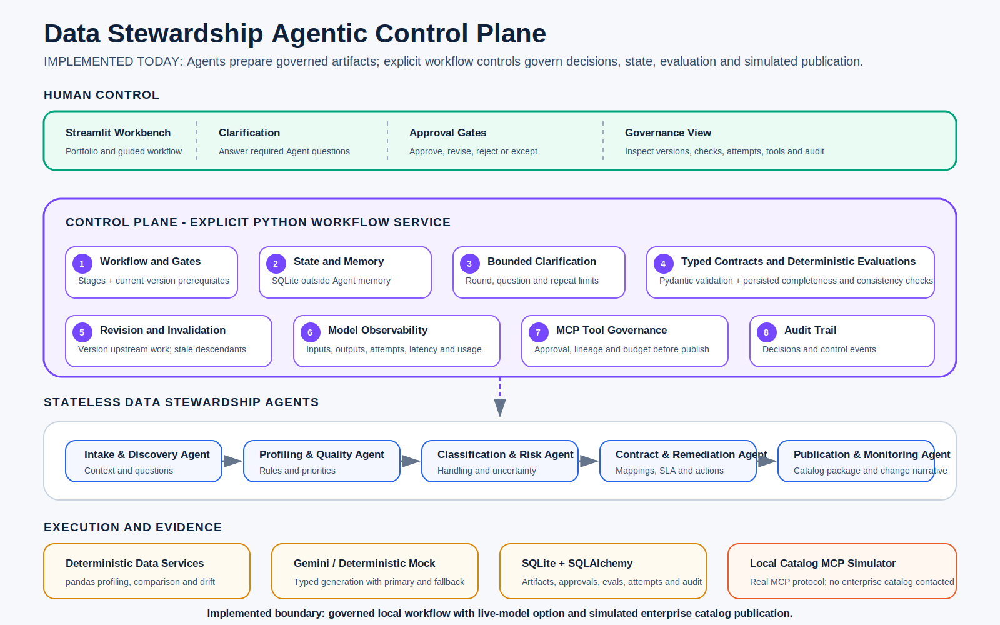
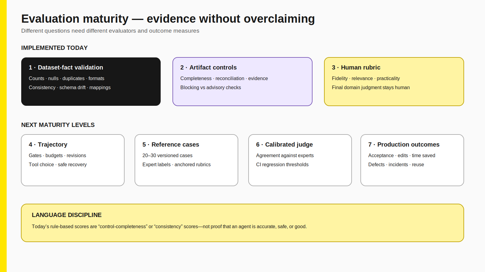
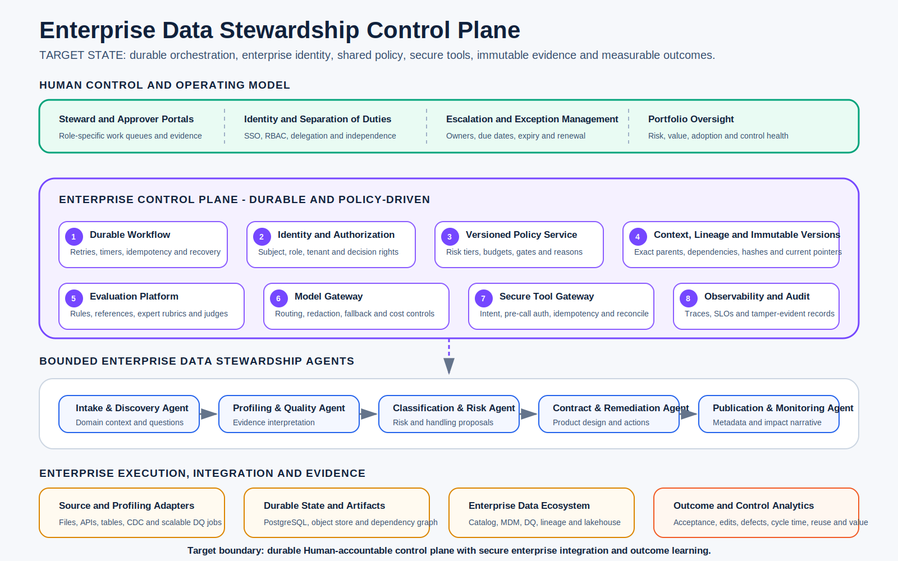

# Data Stewardship Agentic Workflow Reference Implementation

## Building an AI-assisted control plane for trustworthy enterprise data products

This case study presents a working prototype that turns an external dataset into a governed, AI-ready enterprise data product. It combines deterministic data processing, specialized AI Agents, explicit Human approval, version-aware workflow controls and governed catalog publication.

The project is designed around one principle:

> Agents prepare evidence and recommendations. The control plane governs progression and execution. The Human Data Steward remains accountable.

In short, this prototype demonstrates how enterprise data onboarding can use AI Agents without handing authority to them. Deterministic services establish facts, specialist Agents prepare recommendations, Human stewards approve material decisions, and the control plane governs progression, versions, evaluation, evidence and tool execution.

**Primary use case:** onboarding external Legal Entity data  
**Additional domain:** Customer data  
**Implementation:** Python, Streamlit, Pydantic, pandas, SQLAlchemy, SQLite, Gemini, FastMCP and pytest

**Source availability:** The working prototype is maintained separately. This public reference documents the functional workflow, technical architecture, implemented control plane, evaluation approach, and enterprise target state. A walkthrough or source access can be provided on request.

## Contents

**Current reference implementation**

- [Executive summary](#executive-summary)
- [The business problem](#1-the-business-problem)
- [The solution](#2-the-solution)
- [How Agents connect to data](#3-how-the-agents-are-connected-to-the-dataset)
- [Specialist Agents](#4-five-specialist-data-stewardship-agents)
- [Current architecture](#5-current-architecture)
- [Agentic control plane](#6-the-agentic-control-plane)
- [Deterministic facts and Agent reasoning](#7-deterministic-facts-versus-agent-reasoning)
- [Typed artifacts and policy](#8-typed-artifacts-and-policy-packs)
- [Evaluation](#9-evaluation-strategy)
- [Governed workflow validation](#10-governed-workflow-validation)
- [Governed MCP publication](#11-governed-mcp-publication)
- [Capability boundaries](#12-live-deterministic-simulated-and-future-boundaries)

**Enterprise evolution and value**

- [Enterprise target state](#13-enterprise-target-state-and-production-scale)
- [Enterprise value](#14-enterprise-value)
- [Technology choices](#15-technology-choices)
- [Demonstration availability](#16-demonstration-availability)
- [Implementation map](#17-implementation-map)
- [Engineering decisions](#18-engineering-decisions-and-trade-offs)
- [What the project demonstrates](#19-what-this-project-demonstrates)
- [Closing perspective](#closing-perspective)

---

## Executive summary

Enterprise data onboarding is rarely one technical task. A dataset must be understood, profiled, classified, remediated, contracted, approved, published and monitored. Evidence is often fragmented across scripts, spreadsheets, emails, policy documents and catalog forms.

This Workbench brings that journey into one governed workflow:

- deterministic services calculate authoritative dataset facts;
- five specialist Data Stewardship Agents interpret evidence and prepare typed recommendations;
- a Human Data Steward answers material questions and approves classifications, policy changes, contracts and publication;
- an explicit application control plane enforces stages, versions, limits, invalidation and tool authority;
- every artifact, model attempt, decision, evaluation, tool call and audit event is persisted; and
- publication uses a real local MCP client/server boundary against a simulated enterprise catalog.

The result is not an autonomous Data Steward. It is a governed decision-support system that makes data-product onboarding more consistent, reviewable and auditable.

## At a glance

| Dimension | Implemented capability |
|---|---|
| Business workflow | Intake → Assessment → Remediation → Contract → Publication → Monitoring |
| Agents | Five bounded, stateless specialist Agents |
| Data facts | Deterministic local profiling and version comparison |
| Human authority | Version-specific approve, revise and reject decisions with rationale |
| Policy | Versioned domain packs and Human-approved product-policy overrides |
| State | SQLAlchemy persistence in SQLite |
| Model execution | Deterministic mock or live Gemini with bounded fallback attempts |
| Tool execution | Real local MCP protocol with simulated catalog tools |
| Evaluation | Dataset facts, artifact consistency, workflow trajectory and policy/tool behavior |
| Verification | Automated workflow, policy, evaluation, fallback and MCP tests |

---

## 1. The business problem

An external file does not become a trusted enterprise data product simply because it can be loaded into a platform.

Before publication, an accountable organization needs to establish:

- why the dataset is needed and who owns it;
- what each field means and which elements are critical;
- whether required values are complete, unique, valid and current;
- whether personal, confidential or regulated information is present;
- which defects require correction, quarantine or an approved exception;
- what schema, mappings, quality rules, service levels and remediation obligations apply;
- whether a later version invalidates an earlier decision; and
- exactly what was approved and sent to the catalog.

The difficulty is not merely generating a profile or asking an LLM for recommendations. The difficult part is connecting evidence, policy, Human accountability and execution into a controlled lifecycle.

## 2. The solution

The Workbench provides a single journey from source intake to governed publication.



The Human Data Steward remains responsible for material decisions. Agents prepare bounded work products. The control plane prevents an Agent or UI button from bypassing prerequisites.

```text
Create product and establish purpose
  → Intake Agent asks bounded clarification questions
  → deterministic profiling establishes dataset facts
  → Quality and Classification Agents prepare assessments
  → Human corrects data or approves governed decisions
  → Contract Agent proposes mappings, controls and remediation
  → Human approves the exact Contract version
  → Publication Agent prepares the exact catalog package
  → Human approves the exact Publication version
  → control plane authorizes governed MCP tool calls
  → later dataset versions trigger comparison and fresh approval
```

## 3. How the Agents are connected to the dataset

The Agents do not read the CSV directly and Gemini does not scan every row.

```text
CSV or uploaded source
  → pandas reads records locally
  → deterministic profiler calculates a typed DatasetProfile
  → sample values are removed from model context
  → control plane combines facts, policy, Human answers and current versions
  → Agent receives structured JSON and returns a Pydantic-validated artifact
```

For every column, the deterministic profile includes its name, inferred type, null count, completeness and uniqueness. Known-field checks add issue codes, severity, count and evidence. The profiler also compares the observed schema with the domain pack and identifies unfamiliar fields.

For example, when `tax_residency_country` appeared in a later dataset version:

1. the profiler discovered it even though it was absent from the base Legal Entity policy;
2. the Quality Agent received the field name and statistics in `unknown_columns` and the structured column profile;
3. Gemini proposed a cautious meaning, canonical mapping, criticality, sensitivity and allowed quality rules;
4. the proposal explicitly required a Human decision;
5. the Human edited and approved it with rationale; and
6. the control plane created Product Policy v1 and preserved the approved mapping and rules through Contract and Publication.

An Agent can infer a possible meaning from available evidence, but it cannot know an unfamiliar field's authoritative business definition from its name alone. In production, source metadata, schema registries, lineage, data dictionaries and source-owner clarification would enrich this evidence.

## 4. Five specialist Data Stewardship Agents

| Agent | Receives | Produces | Cannot do |
|---|---|---|---|
| Intake and Discovery Agent | Purpose, owner, consumers, frequency, source and domain policy | Summary and up to three material questions | Approve intake or bypass unanswered questions |
| Data Profiling and Quality Agent | Deterministic profile, known rules, unknown fields and product overrides | Critical elements, recurring rules, issue references and unfamiliar-field proposals | Change deterministic counts or approve policy |
| Classification and Risk Agent | Schema/profile, business purpose and sensitivity policy | Classification, sensitive fields, handling and uncertainties | Approve classification or invent unsupported fields |
| Data Contract and Remediation Agent | Approved assessment, Human answers, mappings, rules and lineage | Ownership, SLA, mappings, thresholds and remediation obligations | Change approved rule lineage or approve its Contract |
| Publication and Monitoring Agent | Approved Contract or deterministic before/after changes | Catalog package or change narrative | Publish without Human approval or replace deterministic facts |

Agents are stateless. Each call receives an explicit current context snapshot, returns a typed artifact and ends. Persisted workflow state—not hidden conversation memory—is the system's memory.

## 5. Current architecture



The implementation separates five concerns:

1. **Experience:** Streamlit presents the guided workflow, Human review and governance evidence.
2. **Control plane:** an explicit Python workflow service owns progression, current-version authority, limits, approvals, invalidation and execution policy.
3. **Agent layer:** bounded provider-neutral Agent functions use deterministic mock output or live Gemini structured generation.
4. **Deterministic services:** pandas profiling, Pydantic validation and rule-based evaluators establish facts and consistency.
5. **Execution and evidence:** SQLAlchemy/SQLite persists state; a local FastMCP boundary simulates catalog publication.

The UI does not directly call Gemini or catalog tools. It requests actions from the workflow service, which enforces the same rules regardless of where the request originates.

## 6. The agentic control plane



The control plane implements the governance that an Agent framework alone would not provide:

### Explicit stages and approval gates

Contract generation requires approved current Quality and Classification artifacts. Publication requires an approved current Contract. MCP execution requires approval of the exact current Publication package.

### Version-aware decisions

Approvals reference an artifact ID and version. A decision on a stale or superseded version does not authorize a newer artifact.

### Backward revision and dependency invalidation

When a dataset, assessment, policy decision or Contract changes, dependent artifacts become stale. New evidence and approvals are required rather than silently inherited.

### Bounded clarification and model execution

Clarification rounds, questions per round, physical model attempts, tool calls and estimated cost are policy-limited. Repeated questions and exhausted attempts stop rather than looping indefinitely.

### Human accountability

Agents cannot approve their own work. Material decisions record the named reviewer, exact artifact version, decision, rationale and timestamp.

### Governed tools

The catalog publisher rechecks approval, version lineage, rule equality and tool budget immediately before opening the MCP session.

### Auditability

Workflows, artifacts, questions, answers, decisions, evaluations, model attempts, tool requests/responses and audit events remain queryable in one product-scoped evidence trail.

## 7. Deterministic facts versus Agent reasoning

This separation is central to the design.

| Deterministic processing | Agent reasoning |
|---|---|
| Reads the CSV locally | Receives sanitized structured evidence |
| Calculates rows, columns, nulls and uniqueness | Summarizes why facts matter |
| Executes configured format and allow-list checks | Prioritizes issues and proposes controls |
| Detects duplicates, conflicts and schema drift | Interprets unfamiliar fields cautiously |
| Compares dataset versions | Produces Human-readable change narratives |
| Repeats identically for the same input | May vary and therefore requires evaluation and review |

If a Legal Entity record is missing an LEI, deterministic code establishes the fact and count. The Agent may recommend quarantine, enrichment or escalation, but it does not decide whether the missing value exists.

## 8. Typed artifacts and policy packs

Pydantic contracts define the allowed shape of Intake, Profile, Quality, Classification, Contract, Publication and Monitoring artifacts. A model response cannot become workflow state until it validates.

Domain knowledge is separated from orchestration:

- `domain_packs/legal_entity.json` defines known Legal Entity fields, criticality, profiling checks, allowed rule types, sensitivity guidance and defaults;
- `domain_packs/customer.json` provides a different domain configuration using the same control plane; and
- `domain_packs/prompts/` contains provider-neutral Agent instructions.

Known policy is appropriate context for an Agent, but the prompt is not the enforcement boundary. Deterministic processing, typed validation, current-version checks, evaluation and Human approval enforce the governed result.

## 9. Evaluation strategy

The project deliberately avoids presenting one generic “Agent score” as proof of quality.

Evaluation is separated into:

- **dataset-fact validation:** hashes, dimensions, counts and comparisons reconcile;
- **artifact completeness and consistency:** fields exist, issue codes reconcile and approved rules/lineage remain intact;
- **Human review:** usefulness, domain correctness, ambiguity and risk are assessed with explicit rationale;
- **workflow trajectory:** required stages, approvals, revisions and invalidation occur in the correct order;
- **policy and tool behavior:** limits, forbidden transitions and approval-before-execution are tested; and
- **future quality evaluation:** expert-labelled reference cases, calibrated LLM judges and production outcome measurement.

Current rule-based indicators are described as control-completeness or consistency checks—not as proof of domain recommendation quality.



## 10. Governed workflow validation

The prototype was validated through a complete July 2026 live Gemini run using synthetic Legal Entity data.

The trajectory demonstrated:

1. three bounded Intake questions and persisted Human answers;
2. nine deterministic issue types in the problematic source;
3. a partially remediated version that still contained one critical missing LEI;
4. a clean version with a newly discovered `tax_residency_country` field;
5. a Human-approved product-policy override with mapping and two quality rules;
6. Contract and Publication revisions when Human/control review found issues;
7. primary-model timeouts and successful fallback-model attempts without losing workflow state; and
8. five successful governed MCP operations that created and published simulated draft `SIM-0001` with 10 schema fields and 14 quality rules.

The working prototype retains a readable chronological run narrative and a detailed transcript containing reconstructed complete prompts, sanitized inputs, and typed outputs for every successful Agent call. These materials can be reviewed as part of a walkthrough or source-access discussion.

This validation demonstrates one controlled workflow trajectory using synthetic data. It is not a benchmark of Gemini quality, not a production-readiness claim, and not evidence of integration with a live enterprise catalog.

## 11. Governed MCP publication

Publication uses real local MCP client/server interaction with simulated catalog behavior.

After Human approval, the bounded plan performs:

1. `validate_publication_package`;
2. `create_data_product_draft`;
3. `register_schema`;
4. `register_quality_rules`; and
5. `publish_catalog_draft`.

Every request, response, status, duration and error is persisted. No enterprise catalog is contacted, and no production data product is created.

This clean boundary allows the prototype to demonstrate real tool-governance behavior without claiming integration with a live enterprise catalog.

## 12. Live, deterministic, simulated and future boundaries

| Capability | Honest status |
|---|---|
| CSV profiling and dataset comparison | Real deterministic local processing |
| Workflow stages, approvals, versions and invalidation | Real local service-layer controls |
| Typed artifacts and validation | Real Pydantic implementation |
| Persistence and audit evidence | Real SQLAlchemy/SQLite implementation |
| Deterministic Agent mock | Real, repeatable local demonstration mode |
| Gemini recommendations | Live only when configured and enabled |
| MCP client/server interaction | Real local protocol interaction |
| Enterprise catalog | Simulated |
| Enterprise IAM, RBAC and separation of duties | Future |
| Scalable warehouse/lakehouse profiling | Future integration |
| Distributed durable orchestration | Future target state |
| Production MDM, lineage, DQ and observability | Future integrations |

## 13. Enterprise target state and production scale



Production adoption requires more than connecting the local application to live systems. The target state preserves Human accountability and bounded specialist Agents while strengthening the surrounding platform:

- enterprise identity, tenancy, RBAC and separation of duties;
- durable orchestration for long-running jobs, events, retries and recovery;
- immutable artifact storage, content hashes and dependency lineage;
- versioned policy decisions for data, models, cost, tools and exceptions;
- secure model gateways and approved deployment routing;
- scalable evaluation with reference cases, expert labels and regression gates;
- scoped tool credentials, idempotency, reconciliation and compensation; and
- enterprise catalog, lineage, data-quality, MDM and observability integration.

### Large-dataset processing

The production pattern would preserve the control model while replacing local CSV profiling:

```text
Warehouse, lakehouse, database, stream or API
  → profiling job runs near the data
  → signed compact evidence package
  → control plane prioritizes critical, changed and failed fields
  → Agents interpret bounded evidence batches
  → Human approves material decisions
```

Gemini should not scan millions of rows. Snowflake, Databricks, BigQuery, Spark or an enterprise data-quality platform should calculate facts at scale. The model should receive compact aggregates, failed-rule summaries, schema changes, approved metadata, redacted examples where policy allows and governed evidence references.

For thousands of columns, the control plane would prioritize critical and changed columns, group fields by subject, batch context, allow governed evidence retrieval and combine typed recommendations.

## 14. Enterprise value

### Faster onboarding

Agents prepare questions, assessments, contracts and catalog packages while deterministic services eliminate repeated manual calculation.

### More consistent governance

Typed artifacts, common domain policies, explicit stages and repeatable checks reduce variation across products and teams.

### Better traceability

Dataset versions, evidence, Agent recommendations, Human decisions and tool calls remain connected in one history.

### Reusable control

The control plane separates reusable authority, policy, evaluation and evidence patterns from domain-specific fields and rules. New domains can adopt the same operating model without rebuilding governance around each Agent.

### Safer progression toward automation

Organizations can begin with recommendation-only assistance and increase autonomy by action and risk class. Material, irreversible or low-confidence decisions can remain Human-authorized.

## 15. Technology choices

| Technology | Why it is used |
|---|---|
| Python | Explicit orchestration and data/control services |
| Streamlit | Fast Human-review workbench |
| pandas | Deterministic prototype-scale profiling |
| Pydantic | Typed Agent and artifact contracts |
| SQLAlchemy + SQLite | Durable local workflow and evidence state |
| Google Gemini | Optional live structured recommendation generation |
| FastMCP | Real local governed tool boundary |
| pytest | Executable proof of workflow, policy, evaluation and MCP behavior |
| SVG + Mermaid | Presentation and technical documentation |

No multi-agent framework was added merely to claim framework usage. Explicit orchestration keeps authority and failure behavior inspectable. In a production target state, Temporal could provide durable long-running workflow execution, while LangGraph could support bounded dynamic reasoning inside an individual stage without replacing the enterprise control plane.

## 16. Demonstration availability

The working prototype is maintained separately from this public reference.

This article documents the workflow design, architecture, control-plane implementation, evaluation approach, technology choices, and enterprise target-state pattern. A walkthrough or source access can be provided on request.

A typical demonstration follows this path:

1. create a Legal Entity product with a problematic synthetic dataset;
2. run Intake and answer bounded clarification questions;
3. assess deterministic data facts separately from Agent recommendations;
4. provide a revised dataset version to show partial remediation and blocked progression;
5. provide a later dataset version with an unfamiliar field;
6. approve a product-policy decision with mapping and quality rules;
7. approve Assessment, Contract, and Publication versions; and
8. publish through governed MCP into a simulated catalog and inspect governance evidence.

## 17. Implementation map

The prototype is organized around the following implementation areas:

| Implementation area | Location |
|---|---|
| Streamlit experience | `app.py` |
| Workflow control plane | `datasteward/workflow.py` |
| Typed contracts | `datasteward/contracts.py` |
| Deterministic profiling | `datasteward/profiling.py` |
| Agent provider and prompt assembly | `datasteward/agents.py` |
| Deterministic evaluations | `datasteward/evaluations.py` |
| Persistence models | `datasteward/database.py` |
| Product-policy resolution | `datasteward/policy_overrides.py` |
| Governed MCP publisher | `datasteward/catalog.py` |
| Simulated catalog server | `datasteward/catalog_server.py` |
| Domain packs and prompts | `domain_packs/` |
| Synthetic datasets | `data/` |
| Automated verification | `tests/` |
| Documentation and diagrams | `docs/` |

## 18. Engineering decisions and trade-offs

### Determinism before Agent interpretation

Dataset facts remain reproducible, testable and independent of model availability.

### Human approval as a service-layer rule

Accountability does not depend on whether a UI button is disabled.

### Stateless Agents and explicit memory

Every recommendation can be traced to a persisted context rather than hidden conversational state.

### Product policy without silently rewriting shared policy

A Human can govern an unfamiliar field for one product while enterprise-wide domain-pack promotion remains a separate release decision.

### Honest simulation boundaries

Real MCP protocol behavior is demonstrated without claiming an enterprise catalog connection.

### Prototype simplicity with a production path

SQLite, pandas and Streamlit make the design inspectable. The target architecture documents how identity, scalable profiling, durable orchestration, policy services, immutable lineage and observability would replace local components.

## 19. What this project demonstrates

This project demonstrates the ability to:

- translate a data-governance problem into a usable product workflow;
- distinguish AI reasoning from deterministic data controls;
- design Human-accountable agentic systems;
- implement typed, stateful, version-aware orchestration;
- govern model and tool execution with observable limits and fallbacks;
- preserve policy and quality-rule lineage across artifacts;
- design revision, invalidation and recovery paths;
- integrate a real MCP boundary safely;
- build honest evaluation and capability boundaries; and
- connect a working prototype to an enterprise target architecture and operating model.

---

## Closing perspective

The deeper lesson from this prototype is that model capability is only one component of an enterprise agentic system.

A useful Data Stewardship Agent must interpret quality evidence, classification policy, unfamiliar fields, remediation obligations and publication metadata. A trustworthy data-product operating model must also control state, versions, authority, evaluation, tools, failure and evidence.

> Agents can perform parts of the stewardship work. The control plane and accountable Human decisions are what make that work repeatable, governable and capable of scaling across an enterprise.

---

## Further reading

- [Enterprise Agentic Workflows index](README.md)
- [Media Buying Agentic Workflow Reference Implementation](media-buying-agentic-workflow-reference-implementation.md)

## Disclaimer

All included datasets are synthetic. The Workbench is a local prototype, not a production data-governance platform. Enterprise identity, catalog, lineage, data-quality, MDM and distributed orchestration integrations are explicitly documented as future work.
