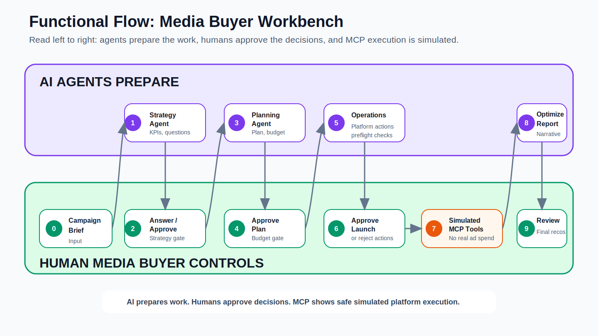
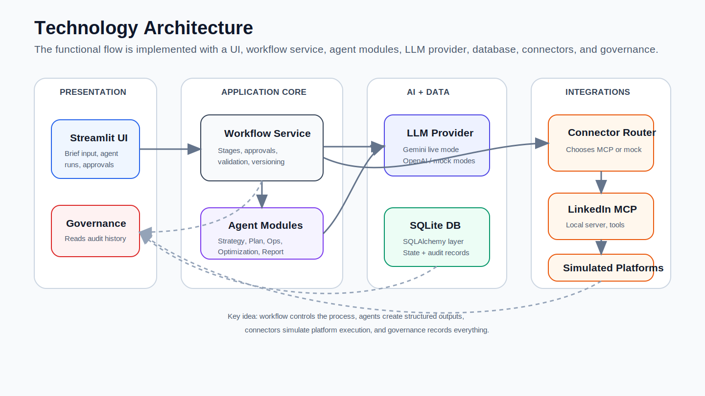
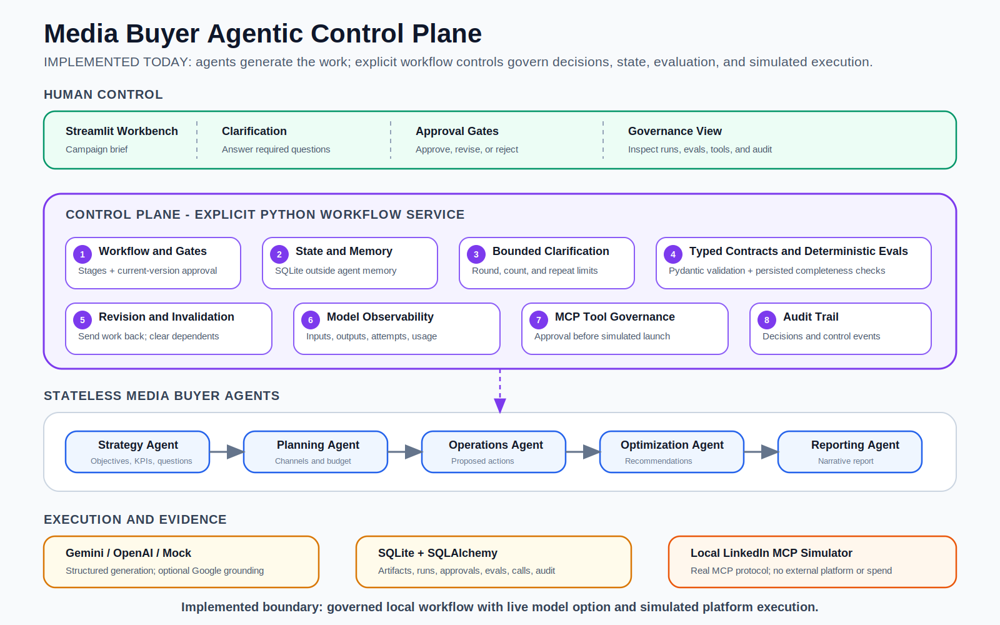
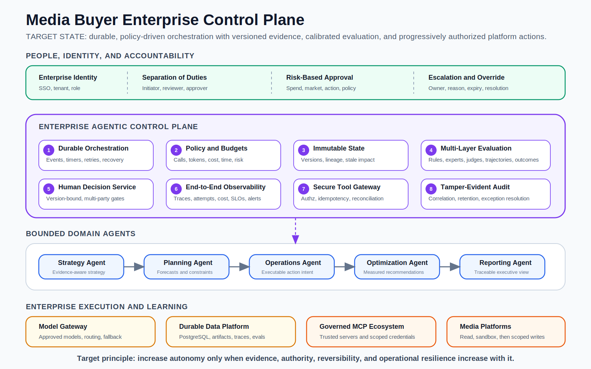

# Media Buying Agentic Workflow Reference Implementation

## From Campaign Brief To Auditable Media Operations

Media buying is rarely constrained by a lack of individual tools. The harder
problem is coordinating strategy, planning, activation, optimization, reporting,
and approval across different teams and platforms without losing context,
accountability, or speed.

I built the **Agentic Media Operations Workbench** to explore a practical
question:

> How can specialized AI agents accelerate media operations while humans retain
> authority over budgets, launch decisions, optimization, and risk?

The result is a production-shaped prototype, not a chatbot and not a claim of
autonomous campaign management. It combines specialized agents with explicit
workflow state, typed artifacts, deterministic controls, human approval gates,
evaluations, model observability, and approval-controlled simulated platform
tools.

This case study explains the functional product, its technical design, the
control plane implemented around the agents, and how the prototype could evolve
into an enterprise MarTech capability.

**Working source implementation:**
[neeleshkalani/Media](https://github.com/neeleshkalani/Media)

## Contents

**Current reference implementation**

- [Executive Summary](#executive-summary)
- [The MarTech Problem](#1-the-martech-problem)
- [Functional Flow](#2-functional-flow)
- [Technical Architecture](#3-technical-architecture)
- [Implemented Control Plane](#4-why-the-control-plane-matters)
- [Evaluation Today](#5-evaluation-what-is-measured-today)
- [Implemented, Live, And Simulated Boundaries](#6-implemented-live-and-simulated-boundaries)

**Enterprise target state**

- [Enterprise Target State](#7-enterprise-target-state)
- [Evaluation Maturity Needed For Production](#evaluation-maturity-needed-for-production)

**Value and reference**

- [Enterprise Value](#8-enterprise-value)
- [Key Design Decisions](#9-key-design-decisions)
- [Demonstration Path](#10-demonstration-path)
- [Repository Guide](#11-repository-guide)
- [Closing Perspective](#closing-perspective)

---

## Executive Summary

The workbench supports a campaign lifecycle from brief through reporting:

1. A media buyer enters the campaign brief, objective, audience, markets,
   budget, dates, and constraints.
2. A Strategy Agent proposes objectives, KPIs, audience, funnel, assumptions,
   and clarification questions.
3. A human answers material questions and approves the current strategy version.
4. A Planning Agent creates a cross-channel plan with exact budget allocation.
5. A human approves the media plan.
6. An Operations Agent translates the plan into proposed platform actions and
   preflight checks.
7. A human approves launch before simulated MCP and connector execution.
8. An Optimization Agent interprets simulated performance evidence and proposes
   bounded recommendations.
9. A human approves optimization before a Reporting Agent creates the final
   narrative.

The important architectural choice is that agents do not govern themselves.
The surrounding control plane owns workflow progression, persistent state,
approval freshness, validation, evaluation, tool boundaries, and audit evidence.

### What is implemented

- A working Streamlit campaign workspace.
- Five specialist agent functions with typed inputs and outputs.
- Gemini live generation, optional OpenAI generation, and deterministic mock
  mode.
- SQLite persistence through SQLAlchemy.
- Version-aware human approvals and backward revision paths.
- Bounded strategy clarification loops.
- Pydantic contracts and deterministic artifact evaluations.
- Model request, response, retry, fallback, usage, and grounding visibility for
  completed runs.
- A real local MCP client/server interaction for simulated LinkedIn Ads tools.
- Governance views covering state, agent runs, evaluations, approvals, MCP
  calls, and audit events.
- Automated tests for workflow and governance controls.

### What is intentionally simulated

- Production advertising accounts and credentials.
- Platform-side campaign creation and media spend.
- Performance ingestion from ad platforms and commerce systems.
- Automated budget changes.

The prototype therefore demonstrates how governed agentic media operations can
work without creating the risk of real campaign side effects.

---

## 1. The MarTech Problem

An enterprise campaign crosses several decision boundaries:

- Business objectives must become measurable media objectives.
- Audience and journey assumptions must become channel choices.
- Channel choices must reconcile to a fixed budget.
- Plans must become platform-specific actions.
- Launch readiness must account for tracking, targeting, creative, exclusions,
  naming, and policy.
- Performance signals must become explainable optimization decisions.
- Every material change needs accountability and evidence.

In a global consumer organization, this becomes harder across markets, brands,
agencies, channels, product launches, data restrictions, and approval models.
Disconnected documents and platform interfaces make it difficult to answer
simple questions consistently:

- Which strategy version was approved?
- Which plan and audience assumptions produced these platform actions?
- Did allocated budgets reconcile to the approved amount?
- What did the model receive and return?
- Which recommendation was generated from which performance evidence?
- Who approved execution?
- What became invalid when an upstream decision changed?

The workbench treats those questions as part of the product rather than as
documentation assembled after the fact.

---

## 2. Functional Flow



Read the diagram from left to right. Agents prepare structured work; humans make
the consequential decisions. The process alternates deliberately between AI
production and human authority.

### Agent responsibilities

| Agent | Inputs | Produces | Does not control |
|---|---|---|---|
| Strategy Agent | Campaign brief, prior strategy, reviewer feedback, clarification answers | Objectives, KPIs, audience, assumptions, funnel, questions | Strategy approval |
| Planning Agent | Brief and approved strategy | Channels, percentages, budgets, roles, structure, risks | Plan approval or budget authority |
| Operations Agent | Brief and approved media plan | Proposed platform actions, preflight checks, blockers | Launch authorization |
| Optimization Agent | Approved plan and supplied performance metrics | Recommendations, rationale, risk, overall assessment | Whether changes execute |
| Reporting Agent | Approved optimization artifact | Executive summary, insights, recommendations, risks | Underlying metrics or prior decisions |

### Human responsibilities

The human media buyer or reviewer:

- Supplies the campaign brief and constraints.
- Answers clarification questions.
- Reviews assumptions and generated artifacts.
- Approves, rejects, or requests revision at each material gate.
- Authorizes simulated launch.
- Decides whether optimization recommendations should progress.

This is not human review added at the end. Human authority is embedded in the
workflow at the points where context, budget, execution, and risk matter.

### Backward movement

Real campaign work is not linear. Planning may expose a weak strategy; platform
preflight may expose a flawed channel or audience decision. The application can:

- Return a media plan to Strategy.
- Return platform actions to Media Planning.
- Return platform actions directly to Strategy.

Reviewer comments become input to the next agent run. Dependent downstream work
is invalidated and must be regenerated and reapproved.

---

## 3. Technical Architecture



The prototype is a modular Python application with clear responsibility
boundaries.

### Presentation

**Streamlit** provides the campaign workspace, forms, workflow tabs, decisions,
tables, metrics, and governance views. It calls application services but does
not own model prompts, SQL queries, workflow authorization, or platform logic.

### Application control

`WorkflowService` is the application coordinator. For each stage it:

1. Loads persisted campaign state.
2. Verifies prerequisite approval for the current artifact version.
3. Builds explicit agent input.
4. Invokes one specialist.
5. validates the typed output.
6. Saves the artifact and agent-run snapshot.
7. Runs deterministic evaluations.
8. Advances the stage and records audit evidence.

The workflow uses explicit Python rather than an agent framework. This keeps a
bounded, stage-based process easy to inspect and test. LangGraph or a durable
workflow engine would become more relevant if production requirements introduced
dynamic delegation, long-running jobs, timers, distributed workers, and complex
recovery.

### Agent and model boundary

Each specialist has role-specific instructions and returns a Pydantic model.
Gemini is the default live provider; OpenAI is optional. Mock mode returns the
same contracts so the workflow can be demonstrated without API availability.

The model contributes judgment where interpretation is useful. Application code
retains deterministic responsibilities such as approval enforcement, budget
invariants, state transitions, tool routing, and audit persistence.

### Persistence

**SQLite** stores the local campaign and governance state. **SQLAlchemy** maps
relational tables and provides the repository and transaction boundary.

Persisted evidence includes:

- Campaign brief and current stage.
- Latest generated artifacts.
- Agent input and output snapshots.
- Clarification questions and answers.
- Approval decisions and reviewer comments.
- Evaluation results.
- Model traces associated with completed runs.
- MCP tool calls and results.
- Business audit events.

The agents remain stateless. The workflow and database hold campaign memory.

### Tool boundary

The workbench is an MCP client. It starts a local FastMCP LinkedIn Ads simulator,
discovers typed tools, validates the campaign, and invokes simulated draft tools
after launch approval. Other platform actions use local mock connectors.

The protocol interaction is real; advertising side effects are not.

---

## 4. Why The Control Plane Matters

An agent can generate a plausible strategy or recommendation. That alone does
not create an enterprise workflow.

The **control plane** is the operating layer that determines:

- What may run and in which stage.
- Which approved inputs an agent receives.
- What state persists across runs.
- When clarification or human approval is mandatory.
- Which deterministic and evaluative checks apply.
- What happens when work moves backward.
- Which tools may execute.
- What evidence is retained.

The core principle is:

> Agents produce work. The control plane governs how that work moves through an
> accountable process.

### Implemented control plane



The current prototype implements eight control categories.

#### 1. Workflow and approval gates

Strategy approval is required before planning, plan approval before operations,
launch approval before tools, and optimization approval before reporting.

An old approval does not authorize a regenerated artifact. The workflow compares
the latest approval with the latest relevant agent run, making decisions
version-aware.

#### 2. Explicit state outside agent memory

Agents receive the exact current context, return one artifact, and finish.
Campaign state, prior versions, decisions, and evidence are persisted outside
the model interaction.

#### 3. Bounded clarification

The Strategy Agent may ask necessary questions, but the workflow limits question
count and clarification rounds. It blocks exact repeated questions and stops the
loop when the configured limit is reached.

#### 4. Typed contracts and deterministic evaluations

Pydantic rejects malformed agent output. Media-plan validators require
allocations to total 100 percent and allocated dollars to equal total budget.

Additional evaluators inspect Strategy, Media Plan, Operations, and Optimization
artifacts for structural completeness, traceability, consistency, and approval
requirements. Results are persisted and displayed to reviewers.

#### 5. Revision and invalidation

Upstream revision clears dependent current artifacts, records the reason, passes
reviewer feedback into regeneration, and requires fresh approvals.

#### 6. Model observability

For completed live runs, Governance can show provider, model, purpose, request,
response, duration, usage, retries, fallback attempts, and grounding metadata.
This distinguishes one user action from the physical API requests it may create.

#### 7. Governed MCP tools

Generated actions remain proposals until launch approval. LinkedIn actions then
travel through discovered MCP tools and produce persisted request/result records.
The MCP server creates simulated drafts only.

#### 8. Audit trail

Campaign creation, agent completion, evaluations, approvals, clarification,
policy stops, revisions, invalidation, and connector launch completion create
business-level audit events.

---

## 5. Evaluation: What Is Measured Today

Agent evaluation is often discussed as though one quality score could determine
whether a system is good. This prototype takes a narrower and more defensible
first step.

### Current deterministic checks

| Artifact | Examples of implemented checks |
|---|---|
| Strategy | Objectives, KPIs, audience, assumptions, funnel, and connection to the brief are present |
| Media Plan | Total matches brief, percentages total 100, dollars reconcile, audience traces to Strategy, risks are present |
| Operations | Actions exist, remain proposed, map to the plan, include preflight checks, and have unique keys |
| Optimization | Metrics and recommendations exist, channels trace to the plan, recommendations require approval |

Each check records its name, result, and explanation. The aggregate score is the
percentage of checks passed, with a descriptive label.

These are best described as **control-completeness and consistency evaluations**.
They do not prove that a strategy is differentiated, that a media mix is optimal,
or that a campaign will deliver incremental business value.

### Why this is still useful

Deterministic evaluations are inexpensive, repeatable, explainable, and suitable
for automated tests. They remove avoidable structural review from humans and
make obvious failures visible before execution.

### Evaluation maturity needed for production

A mature MarTech evaluation program would add:

1. Versioned reference briefs representing brands, markets, objectives, channels,
   constraints, and difficult edge cases.
2. Expert rubrics for strategic coherence, audience quality, channel-role logic,
   measurement design, operational feasibility, and risk.
3. Calibrated model-based judges for selected qualitative dimensions, compared
   continuously with expert labels.
4. Workflow trajectory tests covering clarification, revisions, approvals,
   retries, tool selection, and recovery.
5. Adversarial tests for prompt injection, policy bypass, sensitive information,
   prohibited targeting, unsupported claims, and malicious tool output.
6. Online measurement such as reviewer acceptance, edit distance, time saved,
   launch defects, overrides, incidents, and business outcomes.

Campaign metrics require causal care. CPA or ROAS changes can be affected by
creative, product, promotion, inventory, seasonality, auction conditions,
measurement, and attribution. Production evaluation should use controlled tests,
holdouts, or phased rollout where possible rather than attributing every outcome
to the agent.

---

## 6. Implemented, Live, And Simulated Boundaries

| Capability | Current status |
|---|---|
| Workflow orchestration and stage enforcement | Implemented locally |
| Human approvals and revision decisions | Implemented locally |
| SQLite state and audit history | Implemented locally |
| Typed Pydantic contracts | Implemented locally |
| Deterministic artifact evaluations | Implemented locally |
| Gemini structured generation | Live when configured with a valid key |
| Google Search grounding for Strategy | Optional live capability |
| OpenAI structured generation | Optional provider |
| Deterministic mock generation | Implemented for reliable demonstrations |
| MCP client/server protocol | Real local protocol interaction |
| LinkedIn Ads operations | Simulated; no production account or spend |
| Other advertising-platform actions | Simulated through mock connectors |
| Performance metrics | Deterministically simulated |
| Real commerce, CRM, attribution, or platform data | Not integrated |

This boundary is deliberate. A credible prototype should demonstrate the
governance of consequential actions before acquiring the authority to perform
them.

---

## 7. Enterprise Target State



The target state is not simply the current application connected to production
APIs. Enterprise adoption requires stronger identity, state, policy, evaluation,
and operational controls.

### People and accountability

- Enterprise identity, tenancy, and role-based access.
- Separation of campaign initiator, reviewer, approver, and platform operator.
- Risk-based approval determined by spend, market, data, audience, action, and
  reversibility.
- Managed escalation, exception, override, and expiry.

### Durable orchestration

- Long-running workflow execution with events, timers, retries, and recovery.
- Background jobs for forecasts, platform ingestion, quality checks, and alerts.
- Idempotent handling of repeated events and user actions.

### Immutable artifacts and lineage

- Versioned briefs, strategies, plans, actions, recommendations, and reports.
- Approval bound to an exact artifact ID and content hash.
- Explicit dependency graph and impact analysis.
- Stale, invalid, and revalidation-required states rather than destructive
  replacement.

### Policy and budgets

- Versioned policies for model attempts, tokens, cost, elapsed time, tools,
  spend, markets, audiences, and change thresholds.
- Low-risk reversible actions may become bounded automation.
- Material or irreversible changes remain human-authorized.

### Evaluation platform

- Deterministic rules, reference datasets, expert rubrics, calibrated judges,
  trajectory tests, adversarial tests, and production outcome monitoring.
- Regression gates for prompt, model, policy, tool, and code changes.

### Secure tool execution

- Trusted remote MCP servers or native platform adapters.
- OAuth and scoped credentials from a managed vault.
- Authorization before every tool call.
- Idempotency, rate limits, circuit breakers, dry runs, reconciliation, and
  compensation for partial failure.
- Progressive enablement: read-only data, sandbox drafts, restricted production
  drafts, then narrowly scoped live actions.

### Enterprise MarTech integration

A production media control plane would connect to:

- Ad-platform forecast and execution APIs.
- Customer and audience platforms.
- Consent, privacy, and policy services.
- Digital asset management and creative approvals.
- Product catalog, pricing, promotion, and inventory signals.
- Web and app analytics.
- CRM, conversion, commerce, and incrementality measurement.
- Enterprise data platforms and observability systems.

The objective is not autonomous media buying everywhere. It is adaptive autonomy
within explicit authority, evidence, and recovery boundaries.

---

## 8. Enterprise Value

The prototype is designed around four forms of value.

### Speed

Agents can prepare first drafts of strategy, plans, platform actions,
optimization analysis, and reporting while maintaining one campaign context.

### Consistency

Typed contracts, deterministic rules, common stages, and explicit reviews reduce
variation across campaigns, teams, and agencies.

### Traceability

Inputs, outputs, approvals, revisions, evaluations, and tool calls are connected
to the same campaign history.

### Scalable control

The control plane creates a route from recommendation-only assistance toward
carefully bounded execution. Autonomy can increase by action and risk class
instead of being enabled as one broad system setting.

For senior MarTech leadership, the larger opportunity is a reusable operating
model: common campaign artifacts, decision rights, policy controls, evaluation
standards, integration boundaries, and outcome metrics that can support multiple
brands, markets, channels, and teams.

---

## 9. Key Design Decisions

### Why a workbench rather than a chatbot?

Media operations require forms, artifacts, tables, versions, decisions, and
evidence. Conversation may be one interaction mode, but it is not the operating
model.

### Why specialist agents?

Strategy, planning, platform operations, optimization, and reporting require
different instructions, inputs, contracts, and review criteria. Bounded roles
are easier to evaluate and govern than one broad assistant.

### Why explicit orchestration?

The current workflow is structured and understandable. Plain Python exposes
every transition and control without hiding business progression behind agent
handoffs. A framework should be introduced when it removes real runtime
complexity, not merely to add an agent label.

### Why state outside the agents?

Persistent campaign state can be inspected, resumed, tested, versioned, and
audited. Hidden model memory cannot serve as the authoritative record of an
approved budget or launch decision.

### Why simulated platform execution?

It demonstrates tool discovery, approval boundaries, request/result recording,
and execution flow without production credentials, real spend, or irreversible
side effects.

---

## 10. Demonstration Path

A concise demonstration can cover the architecture in five minutes:

1. Start with the functional diagram and explain the alternating agent and human
   responsibilities.
2. Create or open a campaign brief.
3. Generate Strategy and show assumptions and clarification questions.
4. Answer questions, regenerate, and approve the current version.
5. Generate the Media Plan and show exact budget reconciliation.
6. Generate proposed platform actions and preflight checks.
7. Approve launch and execute the simulated MCP path.
8. Generate the performance and optimization view.
9. Open Governance to show evaluations, model calls, approvals, MCP calls, and
   audit history.
10. Close with the target-state control-plane diagram.

The most important message is not that five agents were connected. It is that
their work was placed inside an inspectable, testable, and governable operating
system.

---

## 11. Repository Guide

The executable prototype is maintained in the
[Media source repository](https://github.com/neeleshkalani/Media). This
reference document and its diagrams are published here so the architecture and
control-plane patterns can be considered alongside other enterprise agentic
workflow examples.

| Area | Location |
|---|---|
| Streamlit product experience | [`app.py`](https://github.com/neeleshkalani/Media/blob/main/app.py) |
| Specialist agent functions and prompts | [`agents/`](https://github.com/neeleshkalani/Media/tree/main/agents) |
| Workflow orchestration and policy | [`services/`](https://github.com/neeleshkalani/Media/tree/main/services) |
| Model provider and telemetry | [`services/llm.py`](https://github.com/neeleshkalani/Media/blob/main/services/llm.py) |
| Deterministic evaluations | [`services/evaluation.py`](https://github.com/neeleshkalani/Media/blob/main/services/evaluation.py) |
| Pydantic domain contracts | [`models/domain.py`](https://github.com/neeleshkalani/Media/blob/main/models/domain.py) |
| SQLAlchemy persistence | [`db/`](https://github.com/neeleshkalani/Media/tree/main/db) |
| MCP client and mock connectors | [`connectors/`](https://github.com/neeleshkalani/Media/tree/main/connectors) |
| Local LinkedIn Ads MCP simulator | [`mcp_servers/linkedin_ads.py`](https://github.com/neeleshkalani/Media/blob/main/mcp_servers/linkedin_ads.py) |
| Automated tests | [`tests/`](https://github.com/neeleshkalani/Media/tree/main/tests) |
| Detailed control-plane implementation | [`CONTROL_PLANE_IMPLEMENTATION.md`](https://github.com/neeleshkalani/Media/blob/main/docs/CONTROL_PLANE_IMPLEMENTATION.md) |
| Current and production data flows | [`END_TO_END_FLOWS.md`](https://github.com/neeleshkalani/Media/blob/main/docs/END_TO_END_FLOWS.md) |
| Run and test instructions | [`RUN_AND_TEST.md`](https://github.com/neeleshkalani/Media/blob/main/docs/RUN_AND_TEST.md) |

After cloning the Media source repository, run locally on Windows with:

```powershell
.\run_app.cmd
```

Use deterministic mock mode with:

```powershell
.\run_app.cmd -Mock
```

Run the tests with:

```powershell
.\.venv\Scripts\python.exe -m pytest -q
```

---

## Closing Perspective

The deeper lesson from this prototype is that model capability is only one part
of an enterprise agentic system.

A useful media agent must be able to reason about objectives, audiences,
channels, performance, and recommendations. A trustworthy media operating model
must also manage state, versions, policy, evaluation, human authority, tools,
failure, and evidence.

> Agents may perform parts of the work. The control plane is what makes that
> work accountable, repeatable, and capable of scaling across an enterprise.
