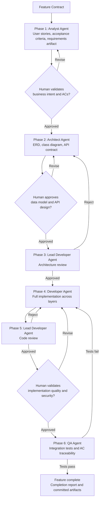

# Role-Based Agentic Software Delivery Reference Implementation

## From Feature Prompt to Tested, Traceable Code

A governed engineering workflow showing how role-based AI Agents assist software delivery while preserving human accountability, engineering controls, review gates and auditability.

Engineering teams are adopting AI coding assistants at pace. The harder question is not whether AI can write code. It is whether AI participation in software delivery can be structured, governed, and traceable in the same way mature engineering organisations structure, govern, and trace the work itself.

I built the **AI-Assisted SDLC Pipeline** to explore a practical question:

> How can specialist AI agents participate across the full software development lifecycle — requirements, architecture, implementation, review, and testing — while humans retain authority over every consequential decision?

The result is a working pipeline. It combines specialist agents with explicit workflow stages, a structured feature contract, a living requirements artifact, human review gates, and a self-improvement loop that improves agent behaviour from real execution data. The pipeline supports both governed delivery — with human review at every consequential stage — and fully autonomous execution, where the Orchestrator Agent drives the complete lifecycle from a single feature contract without manual handoffs between agents.

**Source availability:** The feature contract, prompt templates (new feature, bug fix, feature enhancement, and more), agent definitions, instruction files, and skill modules are maintained in a private repository. Access can be made available on request. This reference documents the functional workflow, agent design, control-plane implementation, and a real-world example of the pipeline in use.

---

## Contents

- [Executive Summary](#executive-summary)
- [The Problem This Addresses](#the-problem-this-addresses)
- [The Solution](#the-solution)
- [The Feature Contract](#the-feature-contract)
- [Agent Design](#agent-design)
- [The Six-Phase Workflow](#the-six-phase-workflow)
- [Grounding Agents in Organisational Standards](#grounding-agents-in-organisational-standards)
- [The Living Requirements Artifact](#the-living-requirements-artifact)
- [The Self-Improvement Loop](#the-self-improvement-loop)
- [Real-World Example](#real-world-example)
- [Key Design Decisions](#key-design-decisions)
- [Further Reading](#further-reading)

---

## Executive Summary

The AI-SDLC Pipeline supports a feature delivery lifecycle from a structured feature contract through documented requirements, approved architecture, implemented code, and a validated, committed test suite.

1. An engineer submits a structured feature contract to the Orchestrator Agent.
2. The Analyst Agent produces formal user stories with Given-When-Then acceptance criteria and persists them as a versioned requirements artifact.
3. Human decision: Validate business intent and acceptance criteria — confirm the right problem is being solved before architecture begins.
4. The Architect Agent reads the requirements artifact and produces entity relationship diagrams, class diagrams, and API contracts.
5. Human decision: Approve the data model and API design — confirm the architecture reflects the right solution before any code is written.
6. The Lead Developer Agent reviews the architecture against defined layer patterns, engineering standards, and security requirements. Can reject back to the Architect Agent.
7. Human decision: Confirm architectural standards are met and approve before implementation begins.
8. The Developer Agent implements the full feature across all architectural layers based on the approved design.
9. The Lead Developer Agent reviews the generated code against the requirements artifact and approved architecture — layer separation, naming consistency, security adherence. Can reject back to the Developer Agent.
10. Human decision: Validate implementation quality and security before testing begins.
11. The QA Agent authors integration tests mapped to every acceptance criterion and maintains a traceability matrix. Test failures route back to the Developer Agent.
12. Human decision: Review test coverage and traceability matrix — confirm every acceptance criterion is validated before feature is marked complete.
13. Feature complete. All artifacts committed to the repository.

The important architectural choice is that agents do not govern themselves. Human decision points are explicit at every consequential stage.

> **The AI proposes. The engineer decides.**

### What is implemented

- Six specialist agents with defined roles, constrained inputs, and structured outputs.
- An Orchestrator Agent that routes work sequentially through the pipeline.
- A structured feature contract that initiates the entire chain.
- A living requirements artifact persisted to the repository and consumed by every downstream agent.
- Instruction files that automatically apply codebase-specific standards based on the artifact being produced.
- Skill modules that agents load on demand for specific tasks.
- Human review gates between every consequential phase.
- Rejection paths from architecture review back to architecture, and from code review and QA back to implementation.
- A traceability matrix mapping every acceptance criterion to a specific test method.
- A self-improvement loop that codifies execution gaps into agent instruction files.

The sections below explain the problem this addresses, how each component works, and a real-world example of the pipeline in use.

---

## The Problem This Addresses

The dominant pattern in AI-assisted development today focuses on code generation. A developer describes a requirement, the AI produces code, and the developer reviews the output. Broader lifecycle concerns — requirements, architecture, traceability, and validation — remain outside the AI's participation entirely.

| Concern | What happens without structure |
|---------|-------------------------------|
| **Architectural drift** | Requirements embedded in conversations make it difficult to maintain consistency as features evolve |
| **Limited traceability** | Without durable artifacts linking requirements, architecture, implementation, and testing, it becomes difficult to understand why decisions were made |
| **Testing misalignment** | Tests validate what was implemented rather than what was originally specified |
| **Ephemeral context** | Requirements exist in a chat window. The conversation ends. The context disappears. |

The underlying challenge is that AI is introduced into a single phase — implementation — rather than being integrated across the full lifecycle.

---

## The Solution

The AI-SDLC Pipeline integrates specialist agents across every stage of the lifecycle — requirements, architecture, implementation, review, and testing.

Each agent operates within a defined scope, produces structured artifacts, and passes them to the next stage. Human decision points sit between every consequential phase. The result is a delivery process that is structured, traceable, and governed — whether running with full human oversight or fully autonomously from a single feature contract.

The pipeline begins with a structured feature contract.

---

## The Feature Contract

The entry point to the pipeline is a structured feature contract — not a vague ticket or ad-hoc conversation. It captures business intent, functional requirements, constraints, and success criteria in a consistent format before any agent begins work.

```
Feature Name:       [Name]
Description:        [One paragraph]

Requirements:
  - [Functional requirements the system must support]

Business Rules:
  - [Non-negotiable logic the system must enforce]

Validation Rules:
  - [Field-level constraints]

Security:
  - [Role-based access definitions]

Integration Requirements:
  - [Upstream/downstream dependencies]

Success Criteria:
  - [Measurable completion conditions]

Out of Scope:
  - [Explicit exclusions to prevent scope creep]
```

The contract becomes the Analyst Agent's primary input. The quality of downstream artifacts is directly tied to the precision of this input. Ambiguity introduced at the beginning of the lifecycle compounds downstream. Clarity creates alignment across every subsequent stage.

---

## Agent Design

Rather than relying on a single AI assistant to perform every task, the pipeline defines discrete agents with constrained roles, specific toolsets, and non-overlapping inputs and outputs. The design mirrors the distinct stages that already exist in mature engineering organisations.

| Agent | Inputs | Produces | Hands off to | Does not control |
|-------|--------|----------|--------------|-----------------|
| **Orchestrator Agent** | Feature contract | Routes work sequentially | Analyst Agent | Nothing — coordinates only |
| **Analyst Agent** | Feature contract | User stories + ACs, requirements artifact | Architect Agent | Architecture, implementation, tests |
| **Architect Agent** | Requirements artifact | ERD, class diagram, API contract | Lead Developer Agent | Implementation, tests, requirements |
| **Lead Developer Agent** | Architecture / Implementation | Review outcome, approval or rejection | Developer Agent / back to Architect Agent | Requirements, implementation code |
| **Developer Agent** | Approved architecture | Implementation across all layers | Lead Developer Agent | Requirements, tests |
| **QA Agent** | Requirements artifact + implementation | Integration tests, traceability matrix | Feature complete / back to Developer Agent | Requirements, architecture, implementation |

The agent design mirrors the discipline of mature software delivery processes — separation of concerns, review gates, traceability, and accountability — applied to an AI-native workflow.

---

## The Six-Phase Workflow



The same pipeline can run in two modes:

| Mode | How it works |
|---|---|
| Governed delivery | Human check-ins occur at consequential stages such as business-intent validation, architecture approval, implementation review, security review, test evidence review and release readiness. |
| Fully autonomous feature implementation | The Orchestrator Agent drives the complete six-phase lifecycle from a single feature contract without manual handoffs between agents. |

The pipeline is capable of fully autonomous feature implementation. In enterprise delivery, human check-ins remain vital at consequential stages because people must review business intent, architecture, security implications, code quality, test evidence, operational readiness and production risk before accepting, merging, releasing or operating the work.

> **The AI proposes. The engineer decides.**

---

## Grounding Agents in Organisational Standards

Generic AI generates generic output. That is not a product limitation — it is the expected behaviour of a system with no knowledge of your organisation's architecture, engineering standards, security requirements, or testing practices.

The pipeline addresses this through three mechanisms:

**Instructions** define the standards applicable to each type of work — architectural patterns, coding conventions, security requirements, and testing approaches. They are automatically applied based on the artifact being produced. When the Developer Agent works on a service class, it loads the relevant framework standards. When it works on a test, it loads the testing conventions. The agent always operates with the exact rules in scope for what it is currently producing.

**Skills** are reusable knowledge modules that agents load on demand for specific tasks. Rather than being applied continuously, they provide targeted guidance at the point of need:

| Agent | Skill loaded |
|-------|-------------|
| Analyst Agent | Requirements capture — user story structure, Given-When-Then criteria, business rule isolation |
| Architect Agent | Architecture modelling — entity design, layer mapping, API contract design |
| Lead Developer Agent | Review — layer separation, naming consistency, security and requirement adherence |
| Developer Agent | Implementation — service patterns, transaction boundaries, security annotations |
| QA Agent | Test authoring — test plans from acceptance criteria, integration test mapping, traceability matrix updates |

**Prompt templates** provide structured inputs for specific task types, ensuring consistent and complete context at every agent invocation. Examples include new feature, bug fix, feature enhancement, add an API endpoint, refactor code, security audit, and individual agent invocation prompts.

Together, these mechanisms ensure organisational knowledge travels with every agent invocation — consistently, repeatably, and without relying on individual engineers to manually reapply standards at every stage.

> **Access:** The feature contract, prompt templates, agent definitions, instruction files, and skill modules used in this pipeline are available on request.

---

## The Living Requirements Artifact

A critical design decision in this pipeline is treating requirements as a first-class engineering artifact rather than conversational context.

Instead of remaining embedded in prompts and chat history, requirements are persisted as a living document within the repository and become the authoritative source of truth for the feature. Every downstream agent references this artifact before beginning work.

This changes the system in several important ways:

**Downstream alignment** — Every agent works from the same baseline. There is a single source of truth for business intent across the entire lifecycle.

**Traceability** — Acceptance criteria remain connected to architecture decisions, implementation artifacts, and tests. The QA Agent tests against what was originally specified — not against what the developer happened to implement. A traceability matrix maps every acceptance criterion to a specific test method.

**Disciplined evolution** — When new requirements, business rules, or edge cases emerge, the requirements artifact is updated first. Architecture, implementation, and testing then evolve from that change.

Conversations and prompts may be transient. Requirements should not be.

---

## The Self-Improvement Loop

Every gap in execution becomes an opportunity to improve the pipeline itself. When an agent deviates from a requirement, misses a validation scenario, or produces an unexpected output, the correction is applied not only to the current feature but also to the underlying process.

Examples from real pipeline runs:

| Gap observed | Correction applied |
|-------------|-------------------|
| Developer Agent missed field mappings between architectural layers | Explicit rule added to developer instruction file |
| Analyst Agent was not persisting requirements to the repository | File-creation tool added to allowed toolset; "Save Requirements to Artifact" added as mandatory workflow step |
| QA Agent was not mapping all acceptance criteria to test methods | Traceability requirement made explicit in QA skill module |

Over time, architectural guidance becomes more precise, review criteria become more robust, and agent behaviour becomes more consistent. Lessons learned are incorporated into the workflow rather than remaining tribal knowledge held by individual engineers.

The pipeline evolves in the same way mature engineering organisations evolve — by capturing lessons learned, codifying best practices, and systematically reducing sources of variation over time.

---

## Real-World Example

### Enterprise Document Management reference implementation

The pipeline was applied to a Java Spring Boot enterprise document-management reference implementation in two phases - first as AI-assisted engineering throughout the broader platform build, then as a fully autonomous pipeline run to validate the orchestrator's end-to-end capability.

---

### Phase 1 - AI-Assisted Engineering: The Broader Reference Implementation

The document-management reference implementation was built using AI-assisted engineering with human review at every stage. The implementation covers:

- Document ingestion and metadata capture
- Search across document metadata and extracted content
- Retention management and legal-hold handling
- Audit trail for document and version operations
- Configurable storage integration

**Platform statistics:**

| Metric | Count |
|--------|-------|
| Source files | 48 |
| Lines of code | ~6,200 |
| Test files | 21 |
| Total tests | 135 |
| Test coverage | 84% |
| API endpoints | 15+ |

AI participated across requirements, architecture, implementation, review, and testing — with human review gates at every consequential stage. Engineers remained responsible for architectural decisions, security validation, and quality outcomes.

---

### Phase 2 — Fully Autonomous Pipeline Run: Document Versioning Feature

With the platform established and architecture conventions in place, the Orchestrator Agent was used to deliver the Document Versioning and History feature in a fully autonomous end-to-end run — no human intervention between agents.

**Purpose:** To validate that the Orchestrator Agent could drive the complete six-phase pipeline from a single feature contract, calling each specialist agent in sequence, passing structured outputs between phases, and producing a complete, tested, committed feature without manual handoffs.

**Feature scope:**
- Upload and describe new document versions
- Retrieve version history
- Download historical versions
- Roll back to a previous version while preserving history
- Detect duplicate version content
- Apply retention handling to document versions
- Record version activity in the audit trail

**Result:**

| Artifact | Count |
|----------|-------|
| User stories | 6 |
| Acceptance criteria | 19 |
| Architecture artifacts | ERD + class diagram + API contract |
| REST API endpoints implemented | 4 |
| Implementation files across all layers | 18 |
| Integration tests | 135 |
| Test files | 21 |
| Test coverage | 84% |
| Requirements → code → test traceability | Complete |

**End-to-end autonomous execution time: 20 minutes.**

From feature contract submission to working, tested, committed code — requirements captured, architecture designed, implementation complete across all layers, code reviewed, and full test suite authored. Zero manual handoffs between agents.

This was a capability validation run. The autonomous execution demonstrates what the orchestrator can drive end-to-end when architecture conventions, coding standards, and instruction files are in place.

A post-run review converted observed gaps into agent-instruction and quality-gate improvements, including documentation-update rules, Mermaid syntax guidance, broader review instructions and stronger retention test coverage.

In a governed production workflow, human review at each gate is the recommended practice — and intentionally extends the total elapsed time. The autonomous capability and the governed model are not in tension. The pipeline supports both. The choice of where to place human gates is an engineering and risk decision for each organisation.

**The AI proposes. The engineer decides. Or — when validated — the pipeline delivers.**

---

## Key Design Decisions

### Why specialist agents rather than one general assistant?

Strategy, requirements, architecture, implementation, review, and testing require different instructions, inputs, constraints, and review criteria. Bounded roles are easier to evaluate, govern, and improve than one broad assistant improvising across all tasks.

### Why a structured feature contract?

The quality of downstream artifacts is directly tied to the quality of the initial input. A structured contract enforces the discipline of capturing business intent, constraints, and success criteria before any agent begins work — rather than discovering gaps mid-pipeline.

### Why persist requirements to the repository?

Requirements that exist only in conversational context disappear when the session ends. Treating the requirements artifact as a first-class repository artifact ensures every agent works from the same baseline, creates an auditable chain from requirement to delivery, and allows the system to evolve in a controlled and traceable way.

### Why human gates if the pipeline can operate autonomously?

The pipeline can operate autonomously for feature implementation. In enterprise delivery, human gates are recommended for consequential decisions such as requirements acceptance, architecture approval, security review, merge approval and production release. Human review keeps requirements honest, architecture sound, implementation aligned, and quality validated against original intent - not only against what happened to be built.

### Why a self-improvement loop?

Agent behaviour that deviates from expected output is a signal, not just an error. Codifying corrections into instruction files means the pipeline improves from real execution data rather than requiring manual re-prompting on every run.

---

## Further Reading

- [Enterprise Agentic Workflows index](README.md)
- [Media Buying Agentic Workflow Reference Implementation](media-buying-agentic-workflow-reference-implementation.md)
- [Data Stewardship Agentic Workflow Reference Implementation](data-stewardship-agentic-workflow-reference-implementation.md)

---

*Interested in the agent definitions, instruction files, skill modules, or implementation guidance? Feel free to connect and reach out.*
